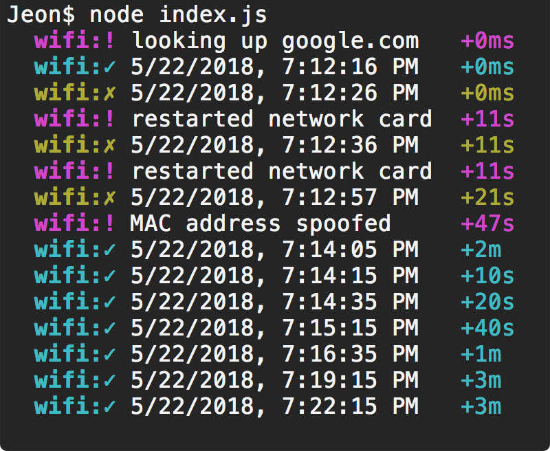
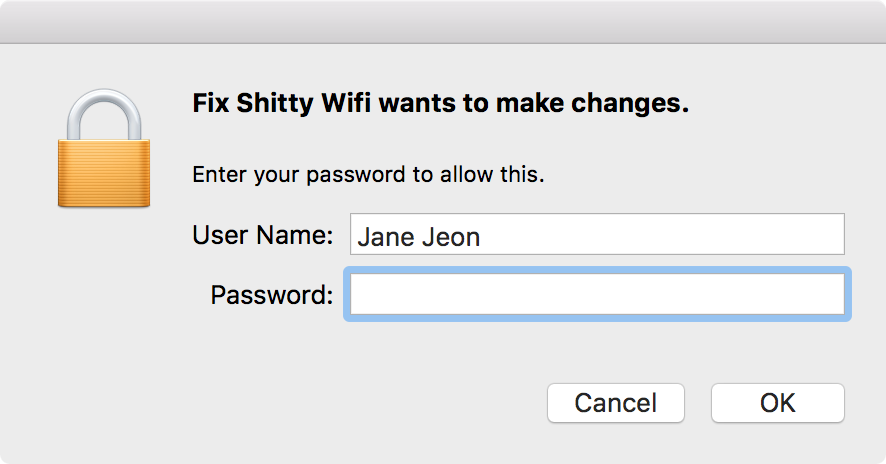

# Fix Shitty Wifi (for macOS)
Fixes various troublesome wifi connections that show any of the following behaviour: 
- disconnect randomly (just bad connection)
- silently cuts you off from the rest of the internet even though the wifi is still connected (*cough* comcast *cough*)
- forces you to sign in every X minutes (think airport wifi)

## Example Usage
`node index.js` to start, `.env` for configuration.

  

### A word about administrator access
To fix troublesome behaviour #3, the program needs to spoof the computer's `MAC address`. To do that, it needs `sudo` access. Thus, it will ask you for your password (popup shown below) every time it is necessary to bypass that behaviour (most airports force you to reconnect after 30-45 minutes).

	

