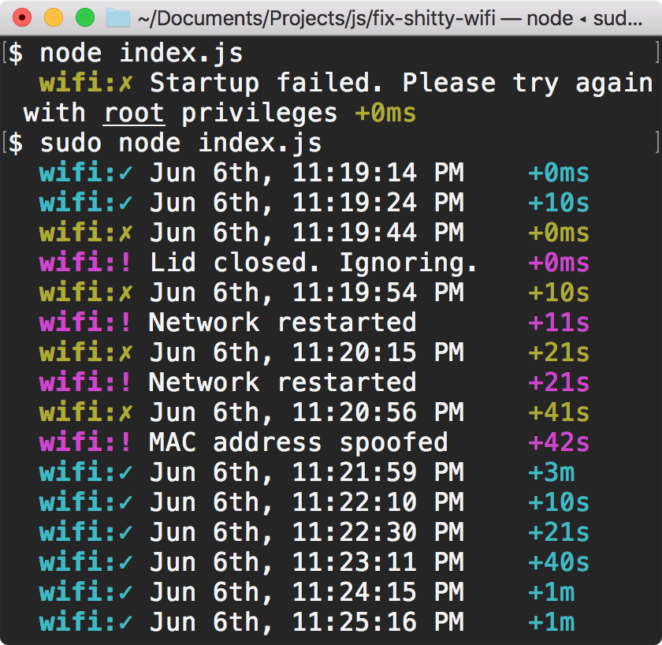

# Fix Shitty Wifi (for macOS)
Fixes various troublesome wifi connections that show any of the following behaviour: 
1. disconnect randomly (spotty/intermittently dropping connection)
2. silently cuts you off from the rest of the internet even though the wifi is still connected (*cough* comcast *cough*)
3. forces you to sign in every X minutes (think airport wifi)

## Sample Usage
`npm install` or `yarn` to install dependencies, then `sudo node index.js` to start, or `npm/yarn start` to prevent memory leaks; edit `.env` for configuration.

  

### Why do I need to provide root privileges?
To fix troublesome behaviour #3, the program needs to spoof the computer's `MAC address`. To do that, it needs `sudo` access. Thus, you will need to start this program as a root user, but once it's running, you do not need to input password any more.
